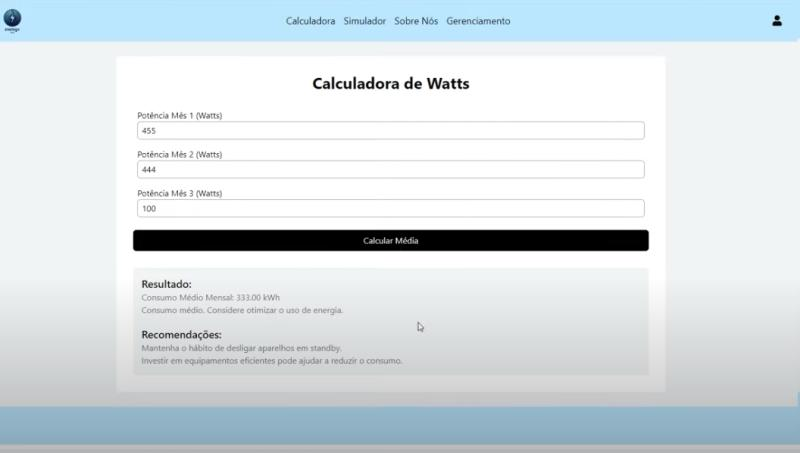
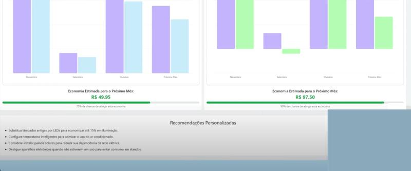

# Projeto-EnergyNow
 
# Energy Now - Gerenciamento de Energia!

## Descritivo

A **Energy Now** é um sistema que visa transformar o modo que você consume energia, oferecendo insights, gerenciamento e transparência no processo no consumo de energia em sua casa. O objetivo do projeto é facilitar o acompanhamento e diminuir o consumo de energia, tendo um consumo conciente, contribuindo para a natureza e o bolso do cliente

**Video Pitch do Projeto:**
LINK: https://www.youtube.com/watch?v=ln3WiU9utYY

## Funcionalidades

- **Calculadora de Watts**: Calculadora simples, onde fazemos uma média de consumo com base nos dados fornecidos e oferecendo pequenas mudanças que vão afetar na diminuição de consumo.
- **Cadastro e Gerenciamento dos eletrodomésticos**:
  - **Cadastrar eletrodoméstico**: Registro como watts por aparelho, tempo ligado são armazenados
  - **Listar eletrodoméstico**: Visualize todos os aparelhos cadastrados na sua conta.
  - **Editar eletrodoméstico**: Atualize as informações de qualquer eletrodoméstico cadastrado, como modelo, marca, e outros dados importantes.
  - **Excluir eletrodoméstico**: Remova os aparelhos cadastrados que não pertencem mais ao seu portfólio.
- **Login e Cadastro**: Faça login ou crie uma conta para acessar todas as funcionalidades da plataforma, como o gerenciamento de aparelhos.
- **Insigths**: Com os dados coletados a plataforme oferece um acompanhamento por meio de gráficos, 
- **Sobre nós**: Conheça o time por trás do ChatCar, além de acessar o repositório do projeto e o link do protótipo utilizado no desenvolvimento.

## Tecnologias Utilizadas

A plataforma foi construída utilizando as seguintes tecnologias:

- **Frontend**: React.js, Next, TypeScript, Styled-components
- **Back/API**: Java - Jersey
- **Banco de Dados**: OracleDB
- **Modelagem**: Trello, Astah
- **Prototipagem**: Figma
- **Hospedagem**: Vercel

